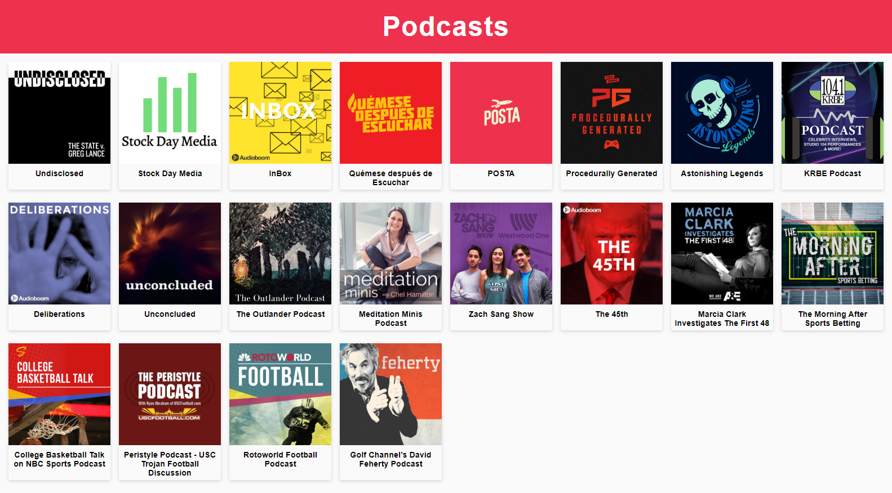

# Podcasts App

Podcasts App itegrated with AudioBoom API to learn Next.js

## How does it work?

Require Node.Js 10

* `npm install` to install the dependencies
* `npm run dev` to run development enviroment
* `npm run build` to run production enviroment

## License

MIT